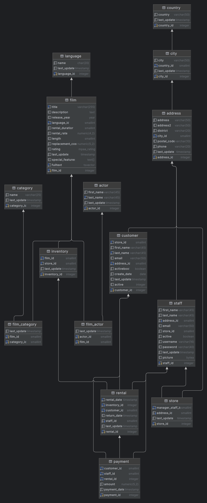
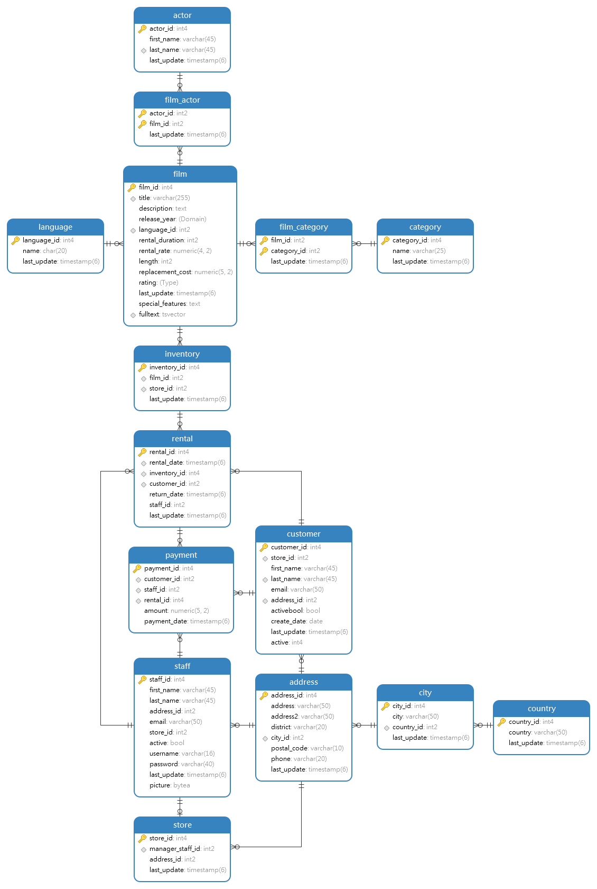
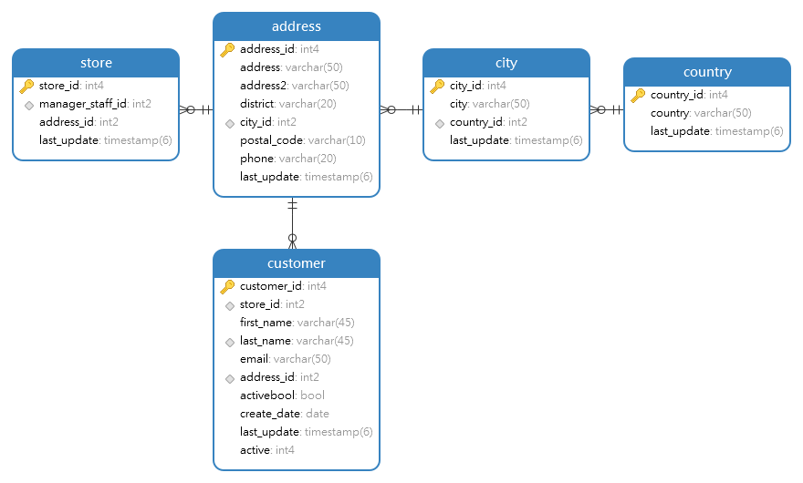
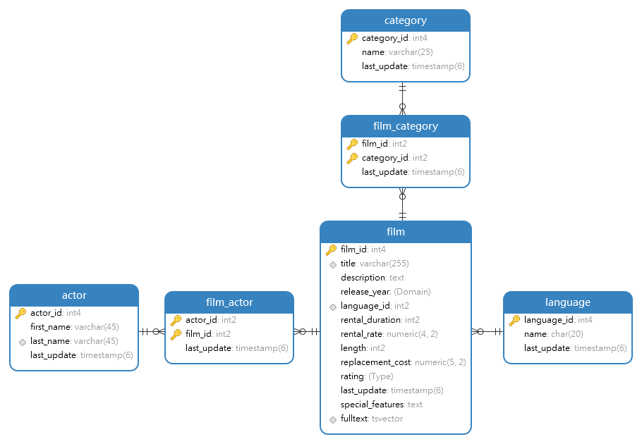

# База данных dvdrental <span id="lnkhome"><span>

---

- [Таблицы](#lnktbl)
- [Представления](#lnkview)
- [Статистика записей](#lnkstat)
- [Диаграммы](#lnkdiagram)
	+ [Все таблицы](#lnkdiagram1)
	+ [Все таблицы(вариант 2)](#lnkdiagram2)
	+ [Адресса](#lnkdiagram3)
	+ [Фильмы и актеры](#lnkdiagram4)

Оригинал базы взят с [ресурса](https://www.postgresqltutorial.com/postgresql-getting-started/postgresql-sample-database/)

---

## Таблицы <span id="lnktbl"><span>

```sql 
select table_schema, table_name, table_type from information_schema.tables
where
    table_schema!='pg_catalog' and table_schema!='information_schema'
    and table_type='BASE TABLE'
```


| Схема | Наименование |
| :--- | :--- |
| public | film |
| public | actor |
| public | address |
| public | category |
| public | city |
| public | country |
| public | customer |
| public | film\_actor |
| public | film\_category |
| public | inventory |
| public | language |
| public | rental |
| public | staff |
| public | store |
| public | payment |

[(вверх)](#lnkhome)

---

## Представления <span id="lnkview"><span>

```sql
select table_schema, table_name, table_type from information_schema.tables
where
    table_schema!='pg_catalog' and table_schema!='information_schema'
    and table_type='VIEW'
```


| Схема | Наименование |
| :--- | :--- |
| public | actor\_info |
| public | customer\_list |
| public | film\_list |
| public | nicer\_but\_slower\_film\_list |
| public | sales\_by\_film\_category |
| public | sales\_by\_store |
| public | staff\_list |

[(вверх)](#lnkhome)

---
## Статистика записей <span id="lnkstat"><span>

Общее количество строк данных в таблицах

```sql 
select nspname || '.' || relname as tablename,
       reltuples as datacount
from pg_class c left join pg_namespace n on (n.oid = c.relnamespace)
where nspname not in ('pg_catalog', 'information_schema')
  and relkind = 'r'
order by reltuples desc;
```

| Таблица | Количество |
| :--- | :--- |
| public.rental | 16044 |
| public.payment | 14596 |
| public.film\_actor | 5462 |
| public.inventory | 4581 |
| public.film | 1000 |
| public.film\_category | 1000 |
| public.address | 603 |
| public.city | 600 |
| public.customer | 599 |
| public.actor | 200 |
| public.country | 109 |
| public.category | 16 |
| public.language | 6 |
| public.staff | 2 |
| public.store | 2 |

[(вверх)](#lnkhome)

---

## Диаграммы <span id="lnkdiagram"><span>

### Все таблицы <span id="lnkdiagram1"><span>



[(вверх)](#lnkhome)

### Все таблицы (вариант 2) <span id="lnkdiagram2"><span>



[(вверх)](#lnkhome)

### Адресса <span id="lnkdiagram3"><span>



[(вверх)](#lnkhome)

### Фильмы и актеры <span id="lnkdiagram4"><span>



[(вверх)](#lnkhome)